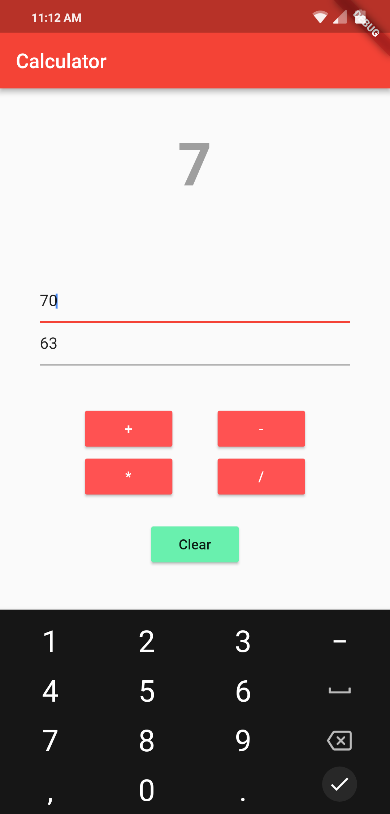

# Basic Calculator App

It is basic calculator app designed using google's API Flutter.
I have attached the screenshots of the app below.

        
      
## Getting Started

For help getting started with Flutter, view our online
[documentation](https://flutter.io/).
